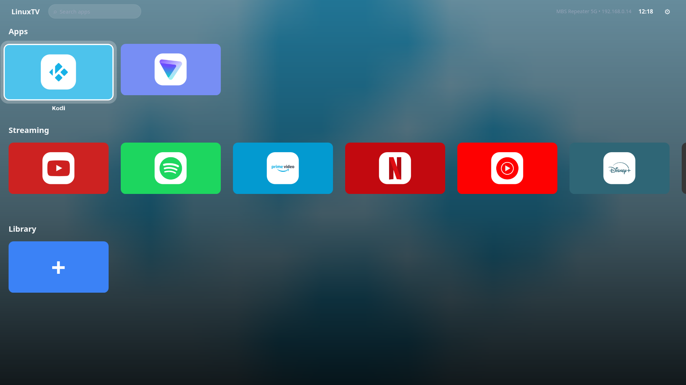
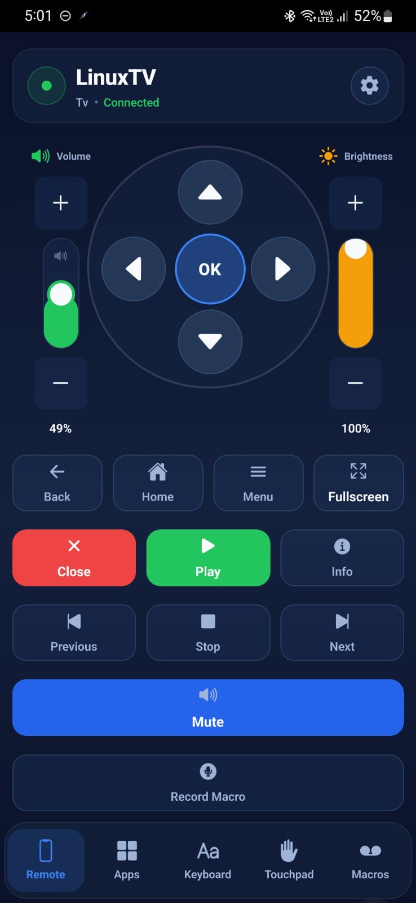

# LinuxTV

A TV-first Linux distro: boot into a fullscreen, remote-friendly app launcher instead of a desktop. Point a PC at a TV, flash the ISO to a USB stick, and it's ready to sit under the TV — navigable from the couch with a phone instead of a keyboard and mouse.

  

## Screenshots

| Desktop | Remote |
|---|---|
|  |  |

## What's in the box

LinuxTV is three things working together:

- **`linuxtvdesktop/`** — the launcher itself. A Qt Quick (QML) home screen hosted in a Python/PyQt5-PySide6 app: banner app cards with focus zoom and glow, an ambient background that follows the focused app, live search, drag-to-reorder, favorites, and in-scene settings panels for Wi-Fi, Bluetooth, sound, brightness, remote login, and system updates — no old-style popup windows.
- **`linuxtvremote/`** — the phone remote (Android, React Native/Expo). D-pad and touchpad control, a keyboard with modifier keys and shortcuts, macro record/replay, volume/brightness sliders, and full app management (add/remove/reorder) from your phone, all talking to the desktop over a WebSocket.
- **`iso-builder/`** — the Debian trixie live-build config that produces the bootable ISO, plus a cross-platform (Windows/macOS/Linux) flash tool that writes it to a USB stick and sets up a persistence partition so changes survive a reboot.

## Why

A normal desktop isn't built for a TV: icons and windows are too small from across the room, launching anything takes a keyboard and mouse, and a full desktop is more than most people want to navigate with a remote. LinuxTV replaces that with a single fullscreen screen you point a phone at.

## Features

- Fullscreen QML home screen — focus zoom/glow, brand-colored banner cards, ambient backdrop, live clock and search
- Native apps and web apps side by side, with automatic icon/brand-color fetching
- Drag-and-drop reordering, favorites, and a per-app context menu (also reorderable from the phone remote)
- In-scene settings panels: Wi-Fi, Bluetooth, sound, brightness, remote login, auto-open-on-idle, system update
- Phone remote app: D-pad, touchpad, keyboard (with Ctrl/Alt/Shift and copy/paste/undo shortcuts), macro recording, volume/brightness sliders, Wi-Fi/Bluetooth/sound control, power actions (shutdown/reboot)
- Auto-launch-on-idle with a cancelable countdown, for a "walk up and it just plays" setup
- Persistent live USB — settings, added apps, and files survive a reboot without a full install
- Kiosk-mode web apps (Chromium/Firefox) and full native-app support side by side

## Get LinuxTV

- **ISO + remote APK**: [GitHub Releases](https://github.com/guruswarupa/LinuxTV/releases/tag/latest) (mirrored on [SourceForge](https://sourceforge.net/projects/linuxtv/files/release/))
- **Flash tool**: `linuxtv-flash-tool.py` (or the platform-specific `flash-tool-*` script) from the same release — writes the ISO to a USB stick and sets up the persistence partition for you. See [`iso-builder/USB-GUIDE.md`](iso-builder/USB-GUIDE.md).

## Quick start

1. Download `LinuxTV.iso` and the flash tool for your platform from the link above.
2. Run the flash tool, pick your USB drive, and let it write the ISO and create the persistence partition.
3. Boot the USB stick on the machine connected to your TV.
4. Note the IP address shown on the LinuxTV home screen's top bar.
5. Install `LinuxTVRemote.apk` on your phone, enter that IP, and connect.

For building either piece from source, see [`iso-builder/README.md`](iso-builder/README.md) (the ISO) and [`linuxtvdesktop/README.md`](linuxtvdesktop/README.md) (running the launcher directly on an existing Linux install).

## Project layout

| Path | What it is |
|---|---|
| [`linuxtvdesktop/`](linuxtvdesktop/README.md) | The launcher app — QML UI, Python backend, WebSocket remote-control server |
| [`linuxtvremote/`](linuxtvremote/README.md) | The Android remote control app (Expo/React Native) |
| [`iso-builder/`](iso-builder/README.md) | Live-build config for the bootable ISO, plus the USB flash tools |
| [`.github/workflows/`](.github/workflows/README.md) | CI: builds and publishes the ISO, the APK, and the flash tools |
